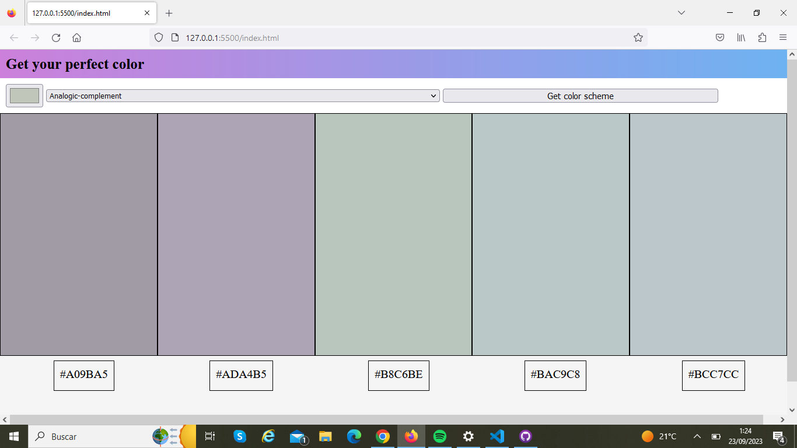

# pick-color
Do you want to improve the colors of your web?
Do you want to make your project match their colors better?

Pick-color app is an app that allows developers choose a hex value from a different range of a chromatic variety of a shame colors

You can choose one of the main color, then choose a color palet that aproach better and then use a chromatic function to approach even more to the palet of colors that you may want to find. 
